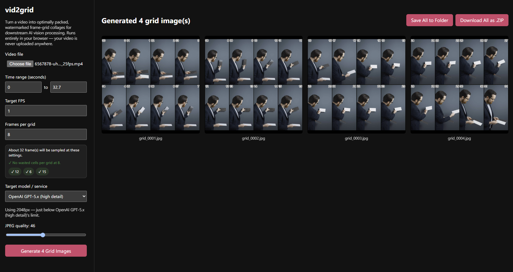
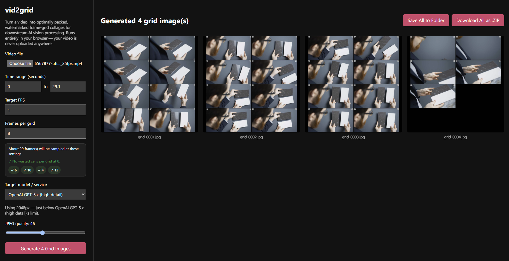
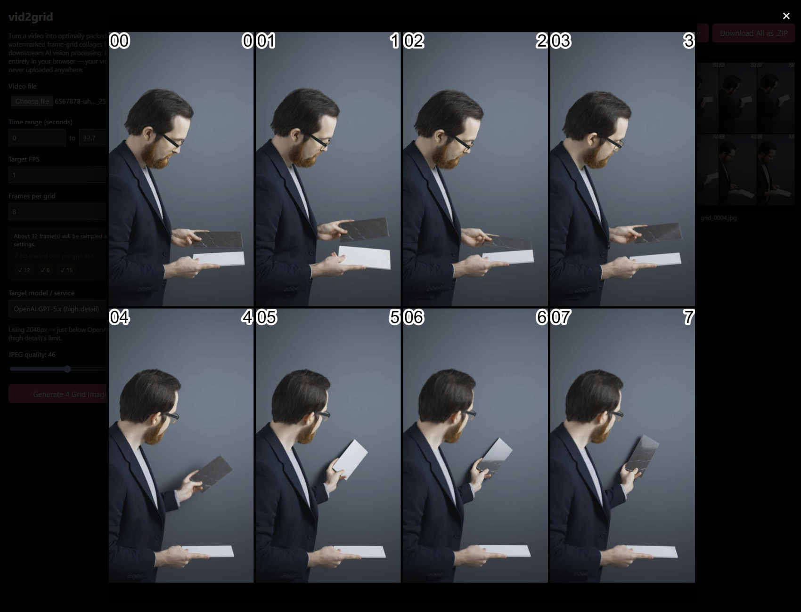
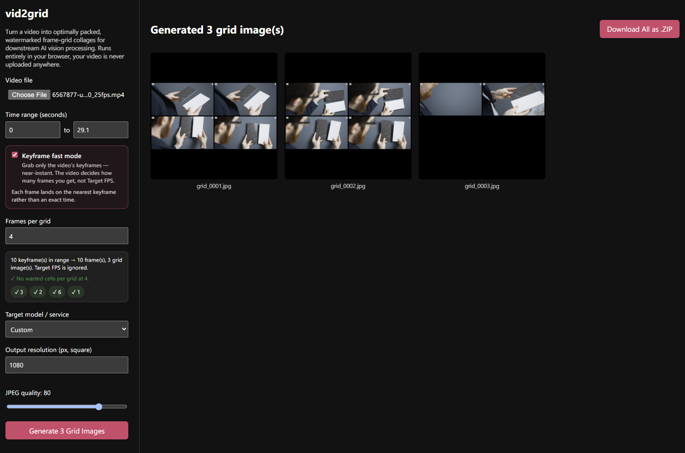

<p align="center">
  <br>
  <a href="https://github.com/IanHeinrich/vid2grid/actions/workflows/pages.yml"></a>
</p>

Parse a video into a grid of frames, optimising the layout of each frame into one or more grid image files, with timestamps and order. Customise the number of frames per grid, output resolution of final images and more.

Runs entirely in your browser, your video is never uploaded anywhere.

### [ianheinrich.github.io/vid2grid](https://ianheinrich.github.io/vid2grid/)

## Contents

- [Screenshots](#screenshots)
- [What it does](#what-it-does)
- [How it works](#how-it-works)
- [Use it](#use-it)
- [Development](#development)
- [Contributing](#contributing)

## Screenshots

The grid packing adapts to the source video's aspect ratio: landscape and
portrait clips each get a layout that maximises every frame's size within the
square sheet:

| Vertical (portrait) source | Horizontal (landscape) source |
| :---: | :---: |
|  |  |

Click any collage in the gallery to view it full-size, with a timestamp and
frame index burned into every cell. For a quick, near-instant preview (or
when exact timestamps don't matter), **Keyframe fast mode** decodes only the
video's keyframes instead of sampling by Target FPS. The sidebar shows the
real frame/grid count and suggestions update live as you toggle it:

| Collage sheet | Keyframe fast mode |
| :---: | :---: |
|  |  |

## What it does

vid2grid turns a video into one or more **collage sheets**: square grid images
that pack many timestamped frames into a single file, sized and shaped for
feeding into AI vision models (OpenAI, Gemini, Claude, Grok, Venice.ai, etc.)
instead of uploading hundreds of individual frames.

- **Drag-and-drop + preview**: drop a video onto the sidebar (or click to
  browse), then set the start/end time range with a dual-handle timeline
  slider (or the number inputs). Grabbing a handle pops up a floating preview
  that follows it and shows the exact frame — no guessing seconds.
- **Time & rate control**: pick a start/end time range and a target sampling
  rate (frames per second).
- **Optimal grid packing**: for a given "frames per grid" count and output
  resolution, it searches every possible row/column split and picks the one
  that maximises each individual frame's size within the square canvas,
  without distorting its aspect ratio.
- **Blank-cell suggestions**: as you tweak the time range, sampling rate, and
  frames-per-grid, the sidebar suggests nearby frames-per-grid values that
  divide the sampled frame count evenly, so the trailing sheet doesn't end up
  with wasted black filler cells.
- **Watermarking**: every frame gets a timestamp (top-left) and its global
  frame index (top-right) burned in as black text with a white stroke, sized
  relative to that frame's actual rendered resolution in the grid.
- **Clean padding**: a black gutter separates every cell (and the outer edge),
  and any left-over cells in a trailing, under-full sheet are filled solid
  black rather than left blank or reflowed into a different layout.
- **Model-aware sizing**: a quick-select in the sidebar sets the output
  resolution just below the known image-input ceiling of popular vision
  models/services, or you can enter a custom resolution.
- **Keyframe fast mode**: an opt-in toggle that decodes only the video's
  keyframes instead of sampling by Target FPS, trading exact frame timing and
  a caller-chosen frame count for a near-instant preview.
- **Generate transcript**: an opt-in toggle that runs an
  in-browser Whisper speech-to-text model on the video's audio track, no
  upload involved. By default it produces one WebVTT (`.vtt`) file per grid
  sheet (e.g. `grid_0001.vtt` alongside `grid_0001.jpg`), covering that
  sheet's frame time range; an extra checkbox switches to a single combined
  `transcript.vtt` for the whole export instead. Cue timestamps are absolute
  to the source video, matching the timestamps already burned into each grid
  cell.
- Results are shown in a gallery (click any collage to view it full-size),
  with a transcript preview under each thumbnail when generated, and
  downloadable as a single `.zip` (or saved folder) containing the JPEGs and
  any transcript files at a configurable quality.

## How it works

<details>
<summary>Everything runs client-side via the <code>&lt;video&gt;</code>/<code>&lt;canvas&gt;</code> (and, where supported, WebCodecs and Web Workers) APIs — no server, no upload. Click to expand the pipeline.</summary>

See [web/](web/) for the full source:

1. [web/src/frameExtraction.ts](web/src/frameExtraction.ts) picks the fastest
   available extraction strategy. For supported browsers and ISO-BMFF files
   (mp4/mov/m4v) it demuxes the file with mp4box.js and decodes the wanted
   sample range in one pass with a WebCodecs `VideoDecoder`
   ([web/src/webcodecsExtractor.ts](web/src/webcodecsExtractor.ts)), including
   an optional keyframe-only fast path for Keyframe fast mode. Otherwise it
   falls back to [web/src/extractor.ts](web/src/extractor.ts), which seeks an
   in-memory `<video>` element to a fixed time-step between the requested
   start/end time and draws each sampled frame to an offscreen `<canvas>`.
   Either way, frames are captured directly at their final collage cell size.
2. [web/src/gridMaths.ts](web/src/gridMaths.ts) computes the optimal
   `(rows, cols, cell size)` layout once per batch, from the requested frames
   per collage and the source frame's aspect ratio.
3. [web/src/renderer.ts](web/src/renderer.ts) draws each sampled frame into
   its final cell position on a collage sheet, watermarks it with its
   timestamp/frame index, and fills any left-over cells with black.
   [web/src/sheetRenderer.ts](web/src/sheetRenderer.ts) parallelises this
   across a pool of Web Workers
   ([web/src/renderWorker.ts](web/src/renderWorker.ts) +
   [web/src/workerPool.ts](web/src/workerPool.ts)) that draw onto an
   `OffscreenCanvas` and JPEG-encode each sheet directly, falling back to
   synchronous main-thread rendering when Workers or `OffscreenCanvas` aren't
   available.
4. When Generate transcript is on,
   [web/src/audioExtraction.ts](web/src/audioExtraction.ts) decodes the
   video's audio track to mono 16kHz PCM via the Web Audio API, and
   [web/src/transcription.ts](web/src/transcription.ts) runs it through a
   Whisper model in [web/src/transcriptionWorker.ts](web/src/transcriptionWorker.ts)
   (transformers.js, off the main thread), turning the model's chunk-level
   timestamps into WebVTT cues.
5. [web/src/core.ts](web/src/core.ts) is the facade (`generateCollages`)
   tying the above together, returning ready-to-use JPEG `Blob`s (plus any
   transcript files) that [web/src/main.ts](web/src/main.ts) renders into the
   gallery and zips up for download.

</details>

## Use it

- **Hosted**: **[ianheinrich.github.io/vid2grid](https://ianheinrich.github.io/vid2grid/)**, no install required.
- **Locally**: see [Development](#development) below for setup.

<details>
<summary>Known limitations</summary>

- No native-FPS clamping: browsers don't expose a video's native frame rate,
  so sampling is purely time-based (`video.currentTime` seeks to the nearest
  frame). Requesting a `targetFps` higher than the source can still produce
  duplicate frames.
- Transcript generation is English-focused (the default model is
  `Xenova/whisper-tiny.en`), downloads its model (~40MB) plus the ONNX
  runtime it runs on (~20MB) from the internet on first use only (cached by
  the browser afterwards; the video/audio itself is never sent anywhere),
  and is noticeably slower without WebGPU. Per-sheet transcripts are a
  best-effort split of the recognized speech by frame time window and may
  divide a sentence across two sheets.

</details>

## Development

`web/` is the only app in this repo (a plain Vite + TypeScript project, no
framework). All commands below are run from that directory.

```bash
git clone https://github.com/IanHeinrich/vid2grid.git
cd vid2grid/web
npm install
```

| Command | Description |
| --- | --- |
| `npm run dev` | Start the Vite dev server with hot reload. |
| `npm test` | Run the vitest suite (jsdom + vitest-canvas-mock; see [web/tests](web/tests)). |
| `npm run build` | Type-check (`tsc -b`) and produce a production build in `web/dist`. |
| `npm run preview` | Serve the `web/dist` production build locally. |

There's no separate lint step. `npm run build`'s `tsc -b` is the type-check
gate, and `npm test` is the correctness gate. Both should pass before opening
a PR.

The [pages.yml](.github/workflows/pages.yml) workflow runs `npm test` on
every push/PR touching `web/**`. On `main`, if `web/package.json`'s `version`
has changed to a value with no existing `vX.Y.Z` git tag, it also tags the
release, publishes a GitHub Release, and deploys `web/dist` to GitHub Pages.

## Contributing

Contributions are welcome: bug reports, feature ideas, and PRs. See
[CONTRIBUTING.md](CONTRIBUTING.md) for the workflow and merge requirements.

