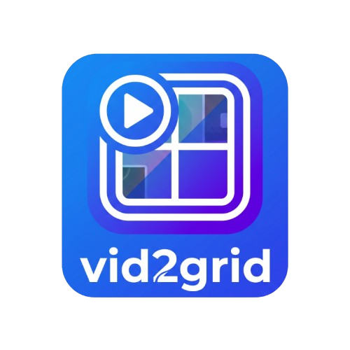
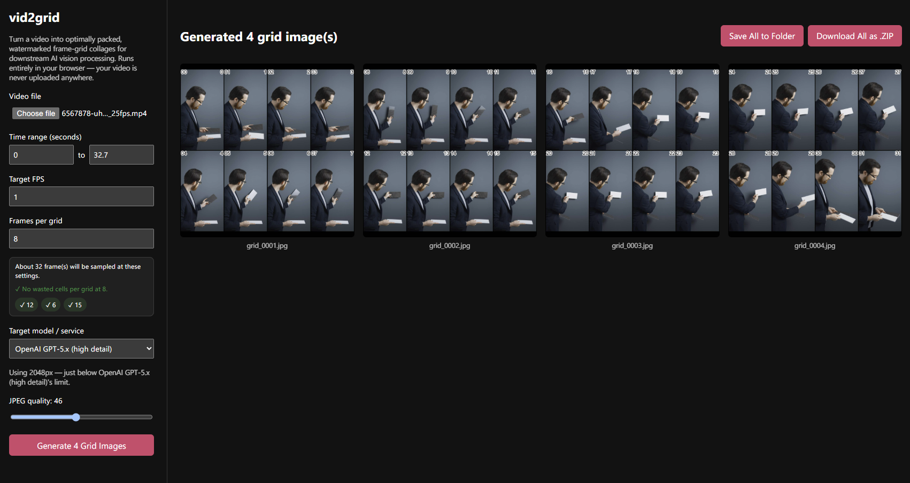
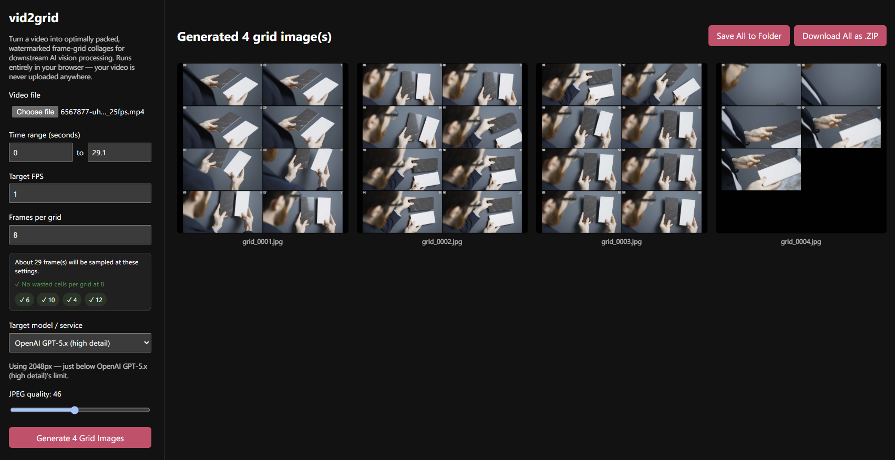
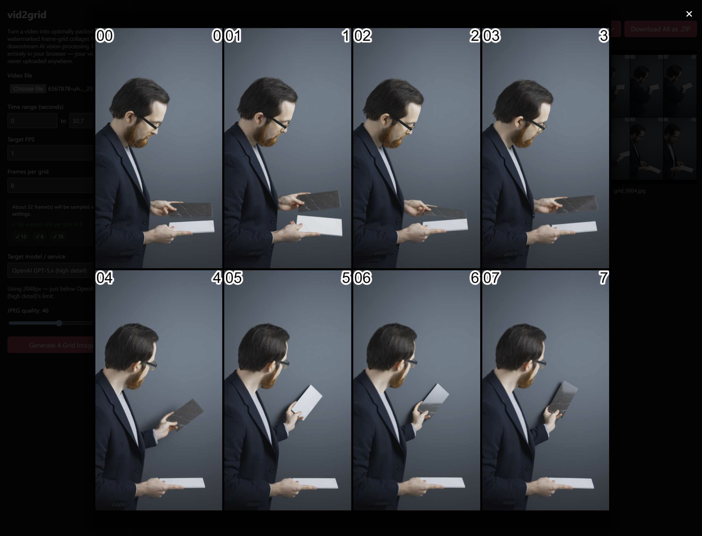
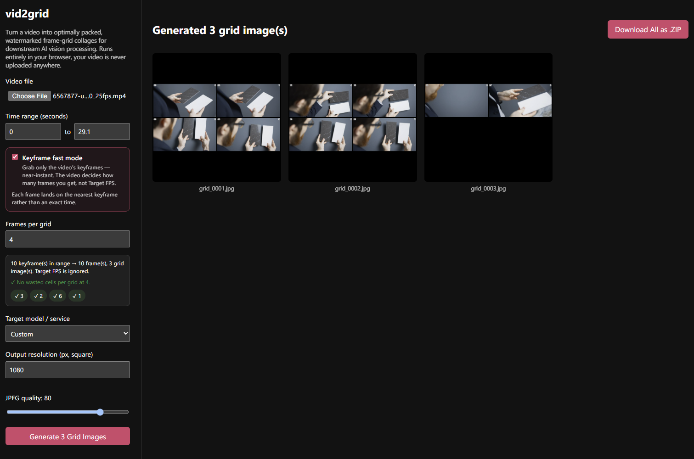
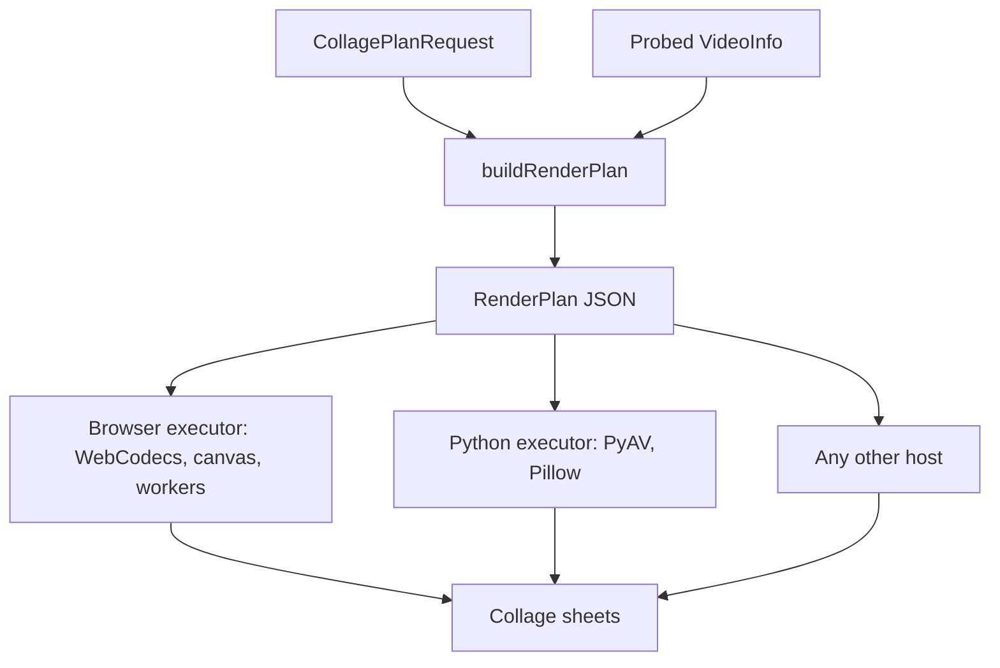

<p align="center">
  <br>
  <a href="https://github.com/IanHeinrich/vid2grid/actions/workflows/pages.yml"></a>
</p>

vid2grid turns a video into **collage sheets**: square grid images that pack
many timestamped frames into one JPEG file. They are sized for feeding into AI
vision models (OpenAI, Gemini, Claude, Grok, Venice.ai) instead of uploading
hundreds of separate frames. Every cell carries its timestamp and frame index,
and the grid layout is chosen to make each frame as large as the sheet allows.

Three ways to use it. The hosted browser app does the whole job client-side, so
your video is never uploaded. The Python package
(`pip install "git+https://github.com/IanHeinrich/vid2grid#subdirectory=python"`)
does it headlessly with PyAV and Pillow, no browser involved. For anything else,
the `RenderPlan` contract is the JSON both of those follow, and a new host
implements only the decoding and painting.

### [ianheinrich.github.io/vid2grid](https://ianheinrich.github.io/vid2grid/)

## Contents

- [Screenshots](#screenshots)
- [What it does](#what-it-does)
- [Architecture](#architecture)
- [Use it](#use-it)
- [Development](#development)
- [Contributing](#contributing)

## Screenshots

The grid packing adapts to the source video's aspect ratio: landscape and
portrait clips each get a layout that maximises every frame's size within the
square sheet:

|                                             Vertical (portrait) source                                             |                                          Horizontal (landscape) source                                          |
| :----------------------------------------------------------------------------------------------------------------: | :-------------------------------------------------------------------------------------------------------------: |
|  |  |

Click any collage in the gallery to view it full-size, with a timestamp and
frame index burned into every cell. For a quick, near-instant preview (or
when exact timestamps don't matter), **Keyframe fast mode** decodes only the
video's keyframes instead of sampling by Target FPS. The sidebar shows the
real frame/grid count and suggestions update live as you toggle it:

|                                                      Collage sheet                                                      |                                                                        Keyframe fast mode                                                                         |
| :---------------------------------------------------------------------------------------------------------------------: | :---------------------------------------------------------------------------------------------------------------------------------------------------------------: |
|  |  |

## What it does

The grid geometry and the burned-in text are decided once, by the planner, and
every host follows that plan. What differs is how each host decodes video, what
it can add on top, and where the sheets end up.

| Host           | Frame sampling by FPS                     | Keyframe fast mode | Watermarks and layout                     | Transcripts                                      | Output                                                 |
| -------------- | ----------------------------------------- | ------------------ | ----------------------------------------- | ------------------------------------------------ | ------------------------------------------------------ |
| Browser app    | Yes, over a start/end range               | Yes                | From the plan                             | In-browser Whisper, WebVTT per sheet or combined | JPEG sheets in a gallery, downloaded as a `.zip`       |
| Python package | Yes, or an exact frame count onto a sheet | Yes                | From the same plan: same cells, same text | None                                             | JPEG files on disk                                     |
| Other hosts    | From the plan                             | From the plan      | From the plan                             | Yours to add                                     | Yours: implement decode, scale, paste, text and encode |

The contract each column follows is specified in
[docs/render-plan.md](docs/render-plan.md).

The browser app in detail:

- **Drag-and-drop + preview**: drop a video onto the sidebar (or click to
  browse), then set the start/end time range with a dual-handle timeline
  slider (or the number inputs). Grabbing a handle pops up a floating preview
  that follows it and shows the exact frame, so you are not guessing at
  seconds.
- **Time & rate control**: pick a start/end time range and a target sampling
  rate (frames per second).
- **Optimal grid packing**: for a given "frames per grid" count and output
  resolution, it searches every possible row/column split and picks the one
  that maximises each individual frame's size within the square canvas,
  without distorting its aspect ratio.
- **Blank-cell suggestions**: as you tweak the time range, sampling rate, and
  frames-per-grid, the sidebar suggests nearby frames-per-grid values that
  divide the sampled frame count evenly, so the trailing sheet doesn't end up
  with wasted black filler cells.
- **Watermarking**: every frame gets a timestamp (top-left) and its global
  frame index (top-right) burned in as black text with a white stroke, sized
  relative to that frame's actual rendered resolution in the grid.
- **Clean padding**: a black gutter separates every cell (and the outer edge),
  and any left-over cells in a trailing, under-full sheet are filled solid
  black rather than left blank or reflowed into a different layout.
- **Model-aware sizing**: a quick-select in the sidebar sets the output
  resolution just below the known image-input ceiling of popular vision
  models/services, or you can enter a custom resolution.
- **Keyframe fast mode**: an opt-in toggle that decodes only the video's
  keyframes instead of sampling by Target FPS, trading exact frame timing and
  a caller-chosen frame count for a near-instant preview.
- **Generate transcript**: an opt-in toggle that runs an
  in-browser Whisper speech-to-text model on the video's audio track, no
  upload involved. By default it produces one WebVTT (`.vtt`) file per grid
  sheet (e.g. `grid_0001.vtt` alongside `grid_0001.jpg`), covering that
  sheet's frame time range; an extra checkbox switches to a single combined
  `transcript.vtt` for the whole export instead. Cue timestamps are absolute
  to the source video, matching the timestamps already burned into each grid
  cell.
- Results are shown in a gallery (click any collage to view it full-size),
  with a transcript preview under each thumbnail when generated, and
  downloadable as a single `.zip` (or saved folder) containing the JPEGs and
  any transcript files at a configurable quality.

## Architecture

Three layers.

1. **The `RenderPlan` contract**: plain JSON from
   [packages/core/src/plan/buildRenderPlan.ts](packages/core/src/plan/buildRenderPlan.ts),
   holding the exact capture timestamps, cell placement, watermark strings and
   file names. Spec: [docs/render-plan.md](docs/render-plan.md).
2. **`packages/core`**: DOM-free pure logic. Grid layout, the planner, and
   `paintSheetFromPlan` for drawing a plan onto any host's canvas. It drives
   the pipeline through host-agnostic ports.
3. **Per-host executors** implement those ports. They only decode, scale,
   paste, draw text and encode: `packages/browser` for this app, and the
   [Python package](python/) for headless use.


```mermaid
flowchart TD
    REQ["CollagePlanRequest"] --> PLANNER["buildRenderPlan"]
    INFO["Probed VideoInfo"] --> PLANNER
    PLANNER --> PLAN["RenderPlan JSON"]
    PLAN --> BROWSER["Browser executor: WebCodecs, canvas, workers"]
    PLAN --> PYTHON["Python executor: PyAV, Pillow"]
    PLAN --> OTHER["Any other host"]
    BROWSER --> SHEETS["Collage sheets"]
    PYTHON --> SHEETS
    OTHER --> SHEETS
```

Sheets from different hosts match in geometry and burned-in text, never in
bytes: a canvas and Pillow rasterise the same string differently. The ten
golden plans in [fixtures/render-plans/](fixtures/render-plans/) are what keeps
the TypeScript and Python planners identical. Both
`packages/core/tests/renderPlanFixtures.test.ts` and
`python/tests/test_planner.py` are pinned to them, so a planner change that
moves one language and not the other fails CI.

<details>
<summary>Click to expand the browser pipeline.</summary>

See [packages/](packages/) and [web/](web/) for the full source:

1. [packages/browser/src/extraction/frameExtraction.ts](packages/browser/src/extraction/frameExtraction.ts) picks
   the fastest available extraction strategy. For supported browsers and ISO-BMFF files
   (mp4/mov/m4v) it demuxes the file with mp4box.js and decodes the wanted
   sample range in one pass with a WebCodecs `VideoDecoder`
   ([packages/browser/src/extraction/webcodecsExtractor.ts](packages/browser/src/extraction/webcodecsExtractor.ts)), including
   an optional keyframe-only fast path for Keyframe fast mode. Otherwise it
   falls back to [packages/browser/src/extraction/extractor.ts](packages/browser/src/extraction/extractor.ts), which seeks an
   in-memory `<video>` element to a fixed time-step between the requested
   start/end time and draws each sampled frame to an offscreen `<canvas>`.
   Either way, frames are captured directly at their final collage cell size.
2. [packages/core/src/grid/gridMaths.ts](packages/core/src/grid/gridMaths.ts) computes the optimal
   `(rows, cols, cell size)` layout once per batch, from the requested frames
   per collage and the source frame's aspect ratio.
   [packages/core/src/plan/buildRenderPlan.ts](packages/core/src/plan/buildRenderPlan.ts) turns
   that plus the settings into a **RenderPlan**, the language-neutral JSON
   contract of capture timestamps, cell placement, watermark strings and file
   names that every step below follows, specified in
   [docs/render-plan.md](docs/render-plan.md).
3. [packages/core/src/render/paintSheetFromPlan.ts](packages/core/src/render/paintSheetFromPlan.ts) draws each sampled frame into
   its final cell position on a collage sheet, watermarks it with its
   timestamp/frame index, and fills any left-over cells with black.
   [packages/browser/src/rendering/sheetRenderer.ts](packages/browser/src/rendering/sheetRenderer.ts) parallelises this
   across a pool of Web Workers
   ([packages/browser/src/rendering/renderWorker.ts](packages/browser/src/rendering/renderWorker.ts) +
   [packages/browser/src/rendering/workerPool.ts](packages/browser/src/rendering/workerPool.ts)) that draw onto an
   `OffscreenCanvas` and JPEG-encode each sheet directly, falling back to
   synchronous main-thread rendering when Workers or `OffscreenCanvas` aren't
   available.
4. When Generate transcript is on,
   [packages/browser/src/extraction/audioExtraction.ts](packages/browser/src/extraction/audioExtraction.ts) decodes the
   video's audio track to mono 16kHz PCM via the Web Audio API, and
   [packages/browser/src/transcription/transcription.ts](packages/browser/src/transcription/transcription.ts) runs it through a
   Whisper model in [packages/browser/src/transcription/transcriptionWorker.ts](packages/browser/src/transcription/transcriptionWorker.ts)
   (transformers.js, off the main thread), turning the model's chunk-level
   timestamps into WebVTT cues.
5. [packages/core/src/pipeline/generateCollages.ts](packages/core/src/pipeline/generateCollages.ts)
   is the facade (`generateCollages`) tying the above together through the
   ports in [packages/core/src/pipeline/ports.ts](packages/core/src/pipeline/ports.ts),
   which [packages/browser/src/index.ts](packages/browser/src/index.ts) implements
   for the browser. It returns named JPEG `Blob`s (plus any transcript files)
   that [web/src/main.ts](web/src/main.ts) renders into the gallery and zips up
   for download.

</details>

## Use it

- **Hosted**: **[ianheinrich.github.io/vid2grid](https://ianheinrich.github.io/vid2grid/)**, no install required.
- **Locally**: see [Development](#development) below for setup.

### Use it from Python

```bash
pip install "git+https://github.com/IanHeinrich/vid2grid#subdirectory=python"
```

```python
from vid2grid import render_single_sheet

result = render_single_sheet("clip.mp4", out_path="sheet.jpg", frames=16)
print(result.to_sheet_row())
```

Same `RenderPlan` contract as the browser app, no transcription. See
[python/README.md](python/README.md) for the full API.

### From another language or service

Write your own executor. Build the plan (or accept one built elsewhere), then
decode, scale, paste, draw text and encode as the plan says.
[docs/render-plan.md](docs/render-plan.md) is the spec, and the golden plans in
[fixtures/render-plans/](fixtures/render-plans/) are test inputs you can pin a
new planner port to.

<details>
<summary>Known limitations</summary>

- No native-FPS clamping: browsers don't expose a video's native frame rate,
  so sampling is purely time-based (`video.currentTime` seeks to the nearest
  frame). Requesting a `targetFps` higher than the source can still produce
  duplicate frames.
- Transcript generation is English-focused (the default model is
  `Xenova/whisper-tiny.en`), downloads its model (~40MB) plus the ONNX
  runtime it runs on (~20MB) from the internet on first use only (cached by
  the browser afterwards; the video/audio itself is never sent anywhere),
  and is noticeably slower without WebGPU. Per-sheet transcripts are a
  best-effort split of the recognized speech by frame time window and may
  divide a sentence across two sheets.
- The Python package does no transcription at all. It normalises rotation from
  a container's display-matrix or `rotate` metadata, but that path is only
  covered by synthetic tests, not by rotated sample files.

</details>

## Development

This repo is an npm workspaces monorepo: `packages/core` holds the DOM-free
pure logic, `packages/browser` implements its ports with browser APIs, and
`web/` (a plain Vite + TypeScript project, no framework) is the app that uses
them. `python/` is a separate, non-npm package with its own toolchain; see
[python/README.md](python/README.md). All commands below are run from the
repo root.

```bash
git clone https://github.com/IanHeinrich/vid2grid.git
cd vid2grid
npm ci
```

| Command                           | Description                                                                                                      |
| --------------------------------- | ---------------------------------------------------------------------------------------------------------------- |
| `npm run dev`                     | Start the Vite dev server with hot reload.                                                                       |
| `npm test`                        | Run the vitest suite across every workspace (jsdom + vitest-canvas-mock for `web/`; see [web/tests](web/tests)). |
| `npm run typecheck`               | Type-check every package (`tsc -b`).                                                                             |
| `npm run build`                   | Type-check, then produce a production build in `web/dist`.                                                       |
| `npm run preview --workspace web` | Serve the `web/dist` production build locally.                                                                   |
| `npm run format`                  | Format the repo with Prettier.                                                                                   |
| `npm run fixtures`                | Regenerate `fixtures/render-plans/` from the planner (required by any planner change).                           |

There's no lint step. `npm run typecheck` (which `npm run build` runs first)
is the type-check gate, `npm test` is the correctness gate, and `npm run
format` is the format step. All three should be clean before opening a PR.

`python/` has its own toolchain, run from that directory. See
[python/README.md](python/README.md) for the uv (or venv) commands.

The [pages.yml](.github/workflows/pages.yml) workflow runs a `test` job (npm
install, `npm test`, `npm run typecheck`, then regenerates fixtures and fails
on drift) and a `python` job (pytest + ruff across Ubuntu, Windows and macOS)
on every push/PR touching the workspaces. On `main`, if `web/package.json`'s
`version` has changed to a value with no existing `vX.Y.Z` git tag, it also
tags the release, publishes a GitHub Release, and deploys `web/dist` to
GitHub Pages.

## Contributing

Contributions are welcome: bug reports, feature ideas, and PRs. See
[CONTRIBUTING.md](CONTRIBUTING.md) for the workflow and merge requirements.
